# Deep Code Analysis: AI Request Model Construction & Tokenization System

**Project**: DSL AI Playground - Intelligent ZEN DSL Learning Platform
**Analysis Focus**: Request Model Construction, Generation, Tokenization & Related Files
**Date**: 2024
**Framework**: React + Node.js/Express + TypeScript

---

## Executive Summary

This system is a sophisticated AI-powered educational platform specialized in teaching ZEN DSL (Domain-Specific Language) for data processing. The core architecture revolves around **intelligent request model construction** that combines semantic knowledge retrieval, conversation state management, and adaptive prompt engineering to generate contextually-aware AI requests.

---

## 1. SYSTEM ARCHITECTURE OVERVIEW

### 1.1 High-Level Design (HLD)

The system follows a **multi-layered semantic AI architecture**:

```
┌─────────────────────────────────────────────────────────────┐
│                    FRONTEND LAYER                           │
│  React Components + Chat Interface + File Upload           │
└─────────────────┬───────────────────────────────────────────┘
                  │ HTTP/JSON Requests
┌─────────────────▼───────────────────────────────────────────┐
│                   API GATEWAY LAYER                        │
│     Express Routes + Request Validation + CORS             │
└─────────────────┬───────────────────────────────────────────┘
                  │ Structured Requests
┌─────────────────▼───────────────────────────────────────────┐
│              AI REQUEST CONSTRUCTION LAYER                  │
│  Prompt Builder + Context Manager + Semantic Retrieval     │
└─────────────────┬───────────────────────────────────────────┘
                  │ Enhanced Prompts
┌─────────────────▼───────────────────────────────────────────┐
│                AI MODEL LAYER                              │
│    Gemini 2.0 Flash + Fallback to 1.5 Flash              │
└─────────────────────────────────────────────────────────────┘
```

### 1.2 Core Technologies

- **Frontend**: React 18 + TypeScript + Vite + TailwindCSS
- **Backend**: Node.js + Express + TypeScript
- **AI Models**: Google Gemini 2.0 Flash (primary) + 1.5 Flash (fallback)
- **Knowledge Base**: Semantic Vector Store with Text Embeddings
- **State Management**: Session-based conversation tracking
- **File Processing**: JSON/Text attachment system with tokenization

---

## 2. AI REQUEST MODEL CONSTRUCTION - CORE ARCHITECTURE

### 2.1 Request Flow Overview

The AI request construction follows a sophisticated **6-stage pipeline**:

```
User Input → Context Analysis → Knowledge Retrieval → Prompt Construction → AI Request → Response Processing
```

### 2.2 Key Components for Request Construction

#### **File**: `apps/server/src/services/enhancedPromptBuilder.ts`
**Purpose**: Central prompt construction engine
**Key Responsibilities**:
- Combines multiple information sources into structured prompts
- Manages token budgets with intelligent allocation
- Applies ZEN DSL-specific prompt engineering

#### **File**: `apps/server/src/services/contextManager.ts`
**Purpose**: Dynamic context and token budget management
**Key Responsibilities**:
- Calculates optimal token allocation across different content types
- Detects conversation flow patterns (learning/problem-solving/exploration)
- Manages 16K token budget with intelligent distribution

#### **File**: `apps/server/src/services/semanticVectorStore.ts`
**Purpose**: Knowledge indexing and semantic retrieval
**Key Responsibilities**:
- Generates embeddings using Google's text-embedding-004 model
- Performs cosine similarity search for relevant knowledge
- Manages document semantic tagging and complexity assessment

---

## 3. REQUEST MODEL CONSTRUCTION - DETAILED BREAKDOWN

### 3.1 Input Processing & Tokenization Pipeline

#### **Stage 1: Content Size Analysis**
**Location**: `apps/server/src/routes/semanticChat.ts` (lines 109-131)

```typescript
function analyzeContentSize(expression: string, input: string, result: string): ContentSizeAnalysis {
  const expressionSize = expression.length;
  const resultSize = result.length;
  const inputSize = new TextEncoder().encode(input).length;
  
  const totalSize = expressionSize + resultSize + inputSize;
  const estimatedTokens = Math.ceil(totalSize / 4); // Token estimation: ~4 chars per token
  
  // Determines if content requires attachment flow vs direct flow
  const requiresAttachment = 
    expressionSize > CONTENT_LIMITS.EXPRESSION_CHARS ||
    resultSize > CONTENT_LIMITS.RESULT_CHARS ||
    inputSize > CONTENT_LIMITS.INPUT_BYTES ||
    totalSize > CONTENT_LIMITS.DIRECT_MESSAGE_CHARS;
}
```

**Content Limits**:
- **Direct Message**: 2000 characters
- **Expression**: 1024 characters  
- **Result**: 2048 characters
- **Input**: 100KB

#### **Stage 2: File Processing & Attachment Creation**
**Location**: `src/services/parserAttachmentService.ts`

The system processes files through a sophisticated attachment pipeline:

1. **File Analysis**: Determines JSON vs text type, calculates size
2. **Metadata Generation**: Creates structured metadata with complexity assessment
3. **Tokenization**: Estimates tokens using 4-character-per-token heuristic
4. **Temporary Storage**: Stores attachments with cleanup mechanisms

```typescript
const jsonMetadata: JsonMetadata = {
  filename,
  sizeBytes: tempAttachment.metadata.sizeBytes,
  topLevelKeys: type === 'json' && typeof data === 'object' && data !== null 
    ? Object.keys(data as Record<string, unknown>)
    : [],
  uploadTime: tempAttachment.metadata.timestamp,
  complexity: determineComplexity(data),
  estimatedTokens: Math.ceil(tempAttachment.metadata.sizeBytes / 4),
  depth: type === 'json' ? calculateObjectDepth(data) : 1
};
```

### 3.2 Dynamic Context & Token Budget Management

#### **Location**: `apps/server/src/services/contextManager.ts` (lines 50-105)

The system uses an **enhanced 16K token budget** with intelligent allocation:

```typescript
private readonly MAX_TOKENS = 16000; // Enhanced from 8K to utilize Gemini 2.0 Flash
private readonly STATIC_HEADER_TOKENS = 400;
private readonly RESERVE_TOKENS = 600;
```

**Budget Allocation Strategy**:
- **Learning Flow**: 60% knowledge cards, 25% history, 15% JSON
- **Problem-Solving Flow**: 45% history, 30% knowledge, 25% JSON  
- **Exploration Flow**: 35% knowledge, 35% history, 30% JSON
- **Default Flow**: Dynamic based on conversation state

#### **Conversation Flow Detection**
The system analyzes user intent using keyword pattern matching:

```typescript
private detectConversationFlow(message: string, history: ChatTurn[]): 
  'learning' | 'problem-solving' | 'exploration' | 'default' {
  
  const learningIndicators = ['what is', 'how does', 'explain', 'teach me'];
  const problemIndicators = ['error', 'fix', 'debug', 'issue', 'problem'];
  const explorationIndicators = ['try', 'test', 'experiment', 'compare'];
}
```

### 3.3 Semantic Knowledge Retrieval & Embedding

#### **Location**: `apps/server/src/services/semanticVectorStore.ts`

**Embedding Generation**:
- Uses Google's `text-embedding-004` model
- Implements caching to reduce API calls
- Batch processing with rate limiting (5 docs per batch, 2s delay)

```typescript
async embedText(text: string): Promise<number[]> {
  const result = await this.embedModel.embedContent(text);
  const embedding = result.embedding.values;
  
  // Cache the result for future use
  this.embeddingCache.set(cacheKey, embedding);
  return embedding;
}
```

**Semantic Search Process**:
1. **Query Embedding**: Convert user query to vector representation
2. **Similarity Calculation**: Cosine similarity against all document embeddings
3. **Filtering**: Minimum similarity threshold of 0.2
4. **Ranking**: Sort by similarity score with diversity filtering
5. **Conversion**: Transform to KnowledgeCard format for prompt integration

### 3.4 Prompt Construction Engine

#### **Location**: `apps/server/src/services/enhancedPromptBuilder.ts` (lines 193-278)

The prompt builder creates structured, multi-section prompts:

**Prompt Sections** (in order):
1. **System Prompt**: ZEN DSL specialist instructions with strict scope enforcement
2. **Knowledge Cards**: Retrieved semantic knowledge with ZEN prioritization  
3. **Conversation History**: Last 6 turns for context continuity
4. **JSON Context**: Uploaded file data or request context
5. **User Message**: Current query with conversation context
6. **Guidelines**: Response formatting and behavior instructions

```typescript
buildSimplePrompt(
  userMessage: string,
  knowledgeCards: KnowledgeCard[],
  history: ChatTurn[],
  simpleResponse: SimpleResponse,
  userProfile?: UserProfile,
  conversationContext?: ConversationContext,
  jsonContext?: string
): EnhancedPromptResult
```

**System Prompt Engineering**:
- **Strict Scope**: ZEN DSL only, no JavaScript/SQL/Python suggestions
- **Error Prevention**: Explicitly lists non-existent functions to avoid hallucination
- **Regex Handling**: Specific rules for proper regex escaping in ZEN expressions
- **Example Formatting**: Structured format with explicit markers

### 3.5 AI Model Request & Resilience

#### **Location**: `apps/server/src/services/resilientGeminiService.ts`

**Model Configuration**:
- **Primary**: Gemini 2.0 Flash (higher performance)
- **Fallback**: Gemini 1.5 Flash (reliability backup)
- **Generation Config**: Temperature 0.7, topK 40, topP 0.95, maxTokens 8192

**Resilience Strategy**:
```typescript
async generateContentWithFallback(prompt: string, sessionId: string): Promise<GeminiResponse> {
  try {
    // Primary: Gemini 2.0 Flash
    const result = await this.gemini20Flash.generateContent(prompt);
    return { text: result.response.text(), model: 'gemini-2.0-flash', wasFallback: false };
  } catch (error) {
    if (this.shouldFallback(error)) {
      // Fallback: Gemini 1.5 Flash
      const fallbackResult = await this.gemini15Flash.generateContent(prompt);
      return { text: fallbackResult.response.text(), model: 'gemini-1.5-flash', wasFallback: true };
    }
    throw error;
  }
}
```

---

## 4. COMPLETE REQUEST PROCESSING FLOW

### 4.1 End-to-End Request Pipeline

#### **Location**: `apps/server/src/routes/semanticChat.ts` (lines 138-350)

**Step-by-Step Process**:

1. **Request Validation & Session Management**
   ```typescript
   const { message, sessionId = generateSessionId(), jsonContext, maxTokens = 16000 } = req.body;
   const conversationHistory = sessionHistories.get(sessionId) || [];
   ```

2. **Conversation State Updates**
   ```typescript
   const userProfile = stateManager.updateUserProfile(sessionId, message);
   const conversationContext = stateManager.updateConversationContext(sessionId, message, conversationHistory);
   ```

3. **Token Budget Calculation**
   ```typescript
   const tokenBudget = contextManager.calculateOptimalBudget(
     message, recentHistory, hasJsonRequest, contextManager.assessQueryComplexity(message)
   );
   ```

4. **Semantic Knowledge Retrieval**
   ```typescript
   const semanticResults = await semanticStore.search(message, 8);
   const knowledgeCards = semanticStore.searchResultsToKnowledgeCards(semanticResults);
   ```

5. **JSON Context Processing**
   ```typescript
   // Phase 1: Content analysis determines attachment vs direct flow
   const contentAnalysis = analyzeContentSize(mockExpression, jsonString, mockResult);
   if (contentAnalysis.requiresAttachment) {
     optimizedJsonContext = `[ATTACHMENT] Large JSON data (${Math.round(contentAnalysis.totalSize / 1024)}KB) - Summary:\n${contentSummary}`;
   } else {
     optimizedJsonContext = jsonString;
   }
   ```

6. **Prompt Construction**
   ```typescript
   const promptResult = promptBuilder.buildSimplePrompt(
     message, knowledgeCards, chatHistoryForPrompt, simpleResponse, 
     userProfile, conversationContext, optimizedJsonContext
   );
   ```

7. **AI Model Request**
   ```typescript
   const geminiResponse = await resilientGeminiService.generateContentWithFallback(
     promptResult.prompt, sessionId
   );
   ```

8. **Response Processing & Session Update**
   ```typescript
   sessionHistories.set(sessionId, [
     ...conversationHistory,
     { role: 'user', content: message, timestamp: new Date() },
     { role: 'assistant', content: finalResponse, timestamp: new Date() }
   ]);
   ```

### 4.2 File & Context Tokenization Details

**Tokenization Strategy**:
- **Estimation Formula**: `Math.ceil(text.length / 4)` (4 characters ≈ 1 token)
- **JSON Processing**: Structured parsing with key extraction
- **Attachment Handling**: Summary generation for large files
- **Context Optimization**: Intelligent truncation based on token budgets

**Files Loaded & Tokenized**:
1. **Knowledge Base**: `.mdc` files containing ZEN DSL documentation
2. **User Files**: JSON/text uploads processed through attachment service
3. **Examples**: DSL examples from various categories (array, string, math, etc.)
4. **Conversation History**: Previous chat turns with timestamp tracking

---

## 5. LOW-LEVEL DESIGN (LLD) FOR MAJOR FEATURES

### 5.1 Semantic Vector Store (Knowledge Retrieval)

**Component**: `SemanticVectorStore`
**File**: `apps/server/src/services/semanticVectorStore.ts`


**Key Methods**:
- `embedText()`: Generates embeddings with caching
- `search()`: Performs semantic similarity search  
- `processBatch()`: Handles rate-limited batch processing
- `applySemanticDiversityFilter()`: Ensures result variety

### 5.2 Enhanced Prompt Builder (Request Construction)

**Component**: `EnhancedPromptBuilder`
**File**: `apps/server/src/services/enhancedPromptBuilder.ts`


**Prompt Structure**:
```
🛡️ STRICT SCOPE ENFORCEMENT: [System prompt with ZEN DSL specialization]

**Relevant ZEN DSL Knowledge:**
[Top 12 semantic knowledge cards with relevance scoring]

**Conversation History:**
[Last 6 conversation turns for context]

**Available Data Context:**
[JSON context or attachment summary]

**Current Question:**
[User message with conversation context]

**Response Guidelines:**
[Formatting and behavior instructions]
```

### 5.3 Dynamic Context Manager (Token Budget)

**Component**: `DynamicContextManager`  
**File**: `apps/server/src/services/contextManager.ts`


**Budget Calculation Logic**:
```typescript
calculateOptimalBudget(message, history, hasJsonContext, queryComplexity): ContextBudget {
  const availableTokens = MAX_TOKENS - STATIC_HEADER - userTokens - RESERVE;
  const conversationFlow = this.detectConversationFlow(message, history);
  
  // Flow-based allocation + complexity adjustments
}
```

### 5.4 Resilient AI Service (Model Requests)

**Component**: `ResilientGeminiService`
**File**: `apps/server/src/services/resilientGeminiService.ts`

```mermaid
graph TD
    A[Prompt Request] --> B[Gemini 2.0 Flash]
    B --> C{Success?}
    C -->|Yes| D[Return Response]
    C -->|No| E{Fallback Appropriate?}
    E -->|Yes| F[Gemini 1.5 Flash]
    E -->|No| G[Throw Error]
    F --> H{Success?}
    H -->|Yes| I[Return Fallback Response]
    H -->|No| J[Both Models Failed]
```



**Fallback Conditions**:
- HTTP 503 (Service Unavailable)
- HTTP 429 (Rate Limited)
- HTTP 500 (Internal Error)
- Messages containing: "overloaded", "capacity", "quota", "rate limit"

---

## 6. SYSTEM CAPABILITIES & FEATURES

### 6.1 Major Features

#### **6.1.1 Intelligent AI Chat Assistant**
- **Scope**: ZEN DSL education and problem-solving
- **Knowledge Base**: Semantic vector store with embeddings
- **Context Awareness**: Session-based conversation tracking
- **Error Prevention**: Strict scope enforcement to prevent hallucinations

#### **6.1.2 Smart File Processing System**
- **Content Analysis**: Automatic size analysis for flow determination
- **Attachment Handling**: Large file summarization vs direct inclusion
- **Multi-format Support**: JSON and text file processing
- **Token Optimization**: Intelligent content truncation

#### **6.1.3 Adaptive Token Management**
- **16K Token Budget**: Enhanced allocation for Gemini 2.0 Flash
- **Flow-Aware Distribution**: Dynamic allocation based on conversation type
- **Complexity Adjustments**: Additional tokens for complex queries
- **Reserve Management**: Safety buffer for unexpected content

#### **6.1.4 Semantic Knowledge Retrieval**
- **Vector Embeddings**: Google text-embedding-004 model
- **Similarity Search**: Cosine similarity with diversity filtering
- **Intelligent Caching**: Reduced API calls through embedding cache
- **Relevance Scoring**: Multi-factor relevance calculation

### 6.2 Minor Features per Major Component

#### **6.2.1 AI Chat Assistant - Minor Features**
- Session persistence with automatic cleanup
- Rate limiting with intelligent queuing
- Conversation flow detection (learning/problem-solving/exploration)
- User profile tracking with query patterns
- Fallback error handling with user-friendly messages
- Real-time processing metrics and analytics

#### **6.2.2 File Processing System - Minor Features**
- Automatic file type detection (JSON vs text)
- Object depth calculation for complexity assessment
- Top-level key extraction for JSON structure analysis
- Temporary attachment storage with TTL cleanup
- Content validation with size limits
- Parser-generated attachment support

#### **6.2.3 Token Management - Minor Features**
- Query complexity assessment (simple/moderate/complex)
- History optimization with turn prioritization
- Budget validation with issue reporting
- Performance metrics collection
- Dynamic reserve allocation
- Context window optimization

#### **6.2.4 Knowledge Retrieval - Minor Features**
- Batch processing with rate limiting
- Semantic tag extraction and clustering
- Document complexity assessment (basic/intermediate/advanced)
- Access frequency tracking
- Cache hit rate monitoring
- Fallback text search for embedding failures

---

## 7. TOKENIZATION & FILE PROCESSING IMPLEMENTATION

### 7.1 Core Tokenization Logic

**Primary Estimation Method** (used throughout system):
```typescript
estimateTokens(text: string): number {
  return Math.ceil(text.length / 4); // ~4 characters per token
}
```

**Advanced Tokenization for Attachments**:
```typescript
// In parserAttachmentService.ts
const estimatedTokens = Math.ceil(tempAttachment.metadata.sizeBytes / 4);
const complexity = determineComplexity(data);
const depth = type === 'json' ? calculateObjectDepth(data) : 1;
```

### 7.2 Files Loaded & Processed

#### **7.2.1 Knowledge Base Files**
- **Location**: Auto-loaded from file system
- **Type**: `.mdc` files (Markdown-like DSL documentation)
- **Processing**: Parsed, chunked, and embedded for semantic search
- **Usage**: Retrieved based on query relevance for prompt enhancement

#### **7.2.2 User Upload Files**  
- **Supported Types**: JSON, text files
- **Size Limits**: 100KB for direct processing
- **Processing Flow**: 
  - Upload → Validation → Size Analysis → Flow Determination → Tokenization → Storage

#### **7.2.3 DSL Example Files**
- **Categories**: Arrays, strings, math, dates, objects, validation
- **Processing**: Loaded into semantic store with category tagging
- **Structure**: Title, expression, input, output, description
- **Usage**: Enhanced prompt context for practical examples

### 7.3 File Integration in Request Construction

**JSON Context Integration**:
```typescript
// Large files: Attachment flow with summarization
if (contentAnalysis.requiresAttachment) {
  const contentSummary = createJsonSummary(uploadedData);
  optimizedJsonContext = `[ATTACHMENT] Large JSON data (${Math.round(contentAnalysis.totalSize / 1024)}KB) - Summary:\n${contentSummary}`;
} else {
  // Small files: Direct flow with full content
  optimizedJsonContext = jsonString;
}
```

**Token Budget Allocation for Files**:
- **JSON Context Budget**: 15-30% of available tokens based on conversation flow
- **Knowledge Cards Budget**: 30-60% based on learning vs problem-solving focus
- **History Budget**: 25-45% for conversation continuity

---

## 8. TECHNICAL IMPLEMENTATION DETAILS

### 8.1 Request Construction Sequence

1. **Input Validation** → 2. **Session Resolution** → 3. **Content Analysis** → 4. **Token Budget Calculation** → 5. **Knowledge Retrieval** → 6. **Context Processing** → 7. **Prompt Assembly** → 8. **AI Request** → 9. **Response Processing** → 10. **Session Update**

### 8.2 Critical Configuration Parameters

```typescript
// Token Management
MAX_TOKENS = 16000;  // Enhanced Gemini 2.0 Flash capacity
STATIC_HEADER_TOKENS = 400;
RESERVE_TOKENS = 600;

// Content Limits  
DIRECT_MESSAGE_CHARS = 2000;
EXPRESSION_CHARS = 1024;
RESULT_CHARS = 2048;
INPUT_BYTES = 100 * 1024; // 100KB

// AI Model Config
temperature: 0.7,
topK: 40, 
topP: 0.95,
maxOutputTokens: 8192
```

### 8.3 Performance Optimizations

- **Embedding Caching**: Reduces redundant API calls
- **Batch Processing**: Rate-limited document processing (5/batch, 2s delay)
- **Session Cleanup**: Automatic cleanup every 5 minutes
- **Content Summarization**: Large file handling without token overflow
- **Conversation Truncation**: History limited to last 6-8 turns
- **Knowledge Card Limiting**: Maximum 8-12 cards per request

---

## 9. SECURITY & ERROR HANDLING

### 9.1 Input Validation & Sanitization
- **File Size Limits**: Enforced at multiple levels
- **Content Type Validation**: JSON parsing with fallback
- **Session Management**: Automatic expiry and cleanup
- **Rate Limiting**: Intelligent queuing with overflow protection

### 9.2 AI Model Resilience
- **Dual Model Setup**: Primary + fallback configuration
- **Error Classification**: Specific fallback conditions
- **Retry Logic**: Exponential backoff for transient failures
- **Circuit Breaker**: Protection against cascading failures

### 9.3 Error Recovery Strategies
- **Graceful Degradation**: Text search fallback when embeddings fail
- **User-Friendly Messages**: Context-aware error explanations
- **Session Recovery**: Persistent state across temporary failures
- **Monitoring Integration**: Comprehensive error tracking and metrics

---

## 10. CONCLUSION

This AI-powered DSL learning platform implements a sophisticated **request model construction system** that intelligently combines semantic knowledge retrieval, adaptive token management, and conversation-aware prompt engineering. The architecture successfully balances performance, reliability, and educational effectiveness through:

1. **Intelligent Token Budget Management**: 16K token allocation with flow-aware distribution
2. **Semantic Knowledge Integration**: Vector embeddings with relevance-based retrieval  
3. **Adaptive Content Processing**: Dynamic handling of small vs large file contexts
4. **Conversation Continuity**: Session-based state management with history optimization
5. **Resilient AI Integration**: Dual-model setup with intelligent fallback mechanisms

The system's strength lies in its ability to **dynamically construct contextually-rich AI requests** that maintain educational focus while providing comprehensive, accurate responses about ZEN DSL capabilities and usage patterns.

**Key Innovation**: The combination of semantic vector search, conversation flow detection, and adaptive token budgeting creates a uniquely effective AI tutoring system that scales intelligently based on user context and content complexity. 